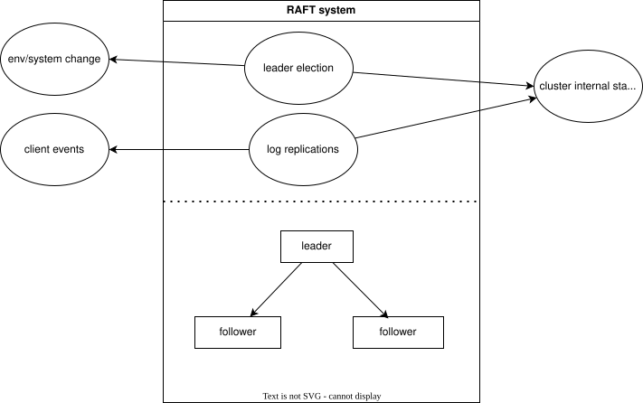

# RAFT
## Purpose
In context distribution system, RAFT offer 2 features:
- A single order of events, operations across servers
- Tolerance to partial failure of cluster.
## Input
- Client requests, commands, events
- System changes.
- Environmental changes.
## Output
- Cluster internal state.
## Arch
- 

## Alternative
- Paxos
## Example
For data replication specifically: ClickHouse's data replication (e.g., in ReplicatedMergeTree engines) is asynchronous and not directly managed by Raft for the data itself—replicas fetch parts from each other via direct communication. However, the leader coordinates the metadata for this process, such as:

Updating shared logs or queues in Keeper to signal which parts need replication.
Ensuring consensus on states like "part X is available on replica Y" or deduplication checks.
Preventing inconsistencies, like duplicate inserts, through linearizable writes.